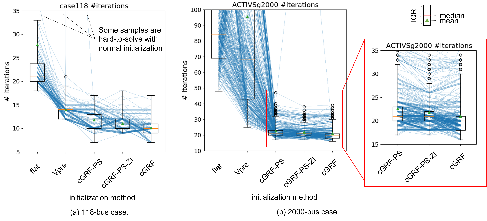

# GridWarm: a warm starter for power grid contingency analysis using probabilistic graphical model

This project is for warm starting power grid contingency analysis in the context of MadIoT attack which can manipulate the loads to cause possible blackouts and disturbances. 

Given the system information and contingency information, the warm starter learns a mapping to the grid bus voltages after contingency. The estimate is further used in a power flow solver as an initialization point. The aim is to start from a good initial point so that the power flow solver converges quickly. The warm-starter uses an pairwise conditional gaussian random field model that captures the graph structure (topology) of power grid and adopts neural nets to learn the potential functions that make up the joint distribution. 

Results showed its efficacy in have faster convergence compared with traditional initializations:



See this paper for more details:
```
@article{li2022gridwarm,
  title={Towards Practical Physics-Informed ML Design and Evaluation for Power Grid},
  author={Li, Shimiao and Pandey, Amritanshu and Pileggi, Larry},
  journal={arXiv preprint arXiv:2205.03673},
  year={2022}
}
```

Project source code structure:
```
root
│   
└───main.py  # main script that trains and evaluates the ML model
│
└───Data
│   │ # where datasets are stored (e.g. download data here)
│
└───ML
│   │
│   |#where data structure, preprocessing, ML models, train and loss functions are defined 
│   
└───Figure
│   │  # where output figures are saved
│  
└───ML_Output
|   |
│   └───case_name
│   │   │
│   │   └───saved_model #trained models and checkpoints are saved here
```


